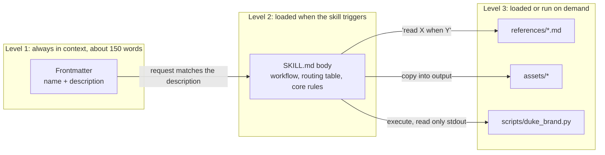
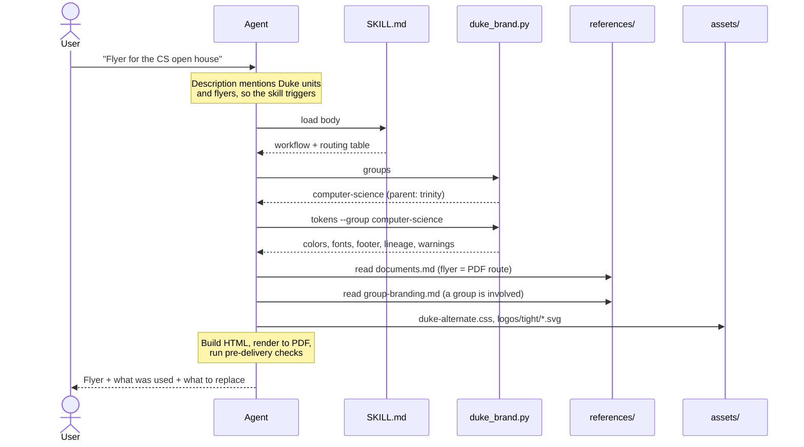
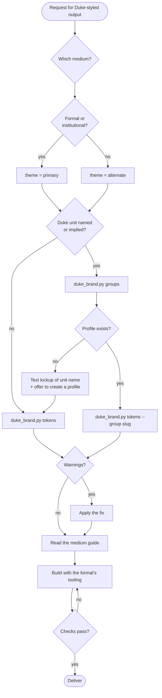
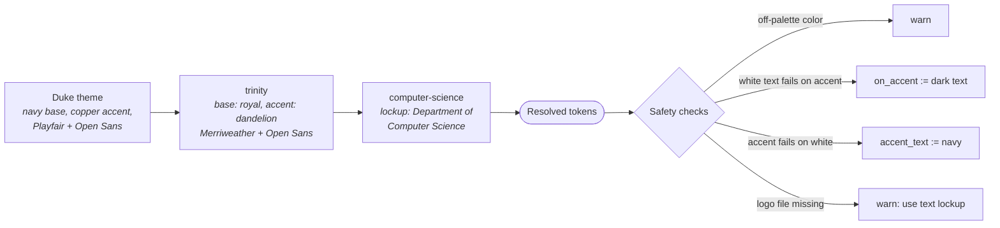
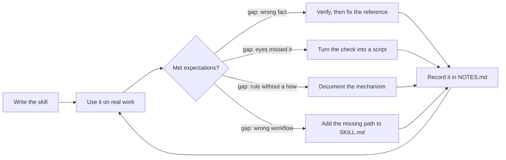
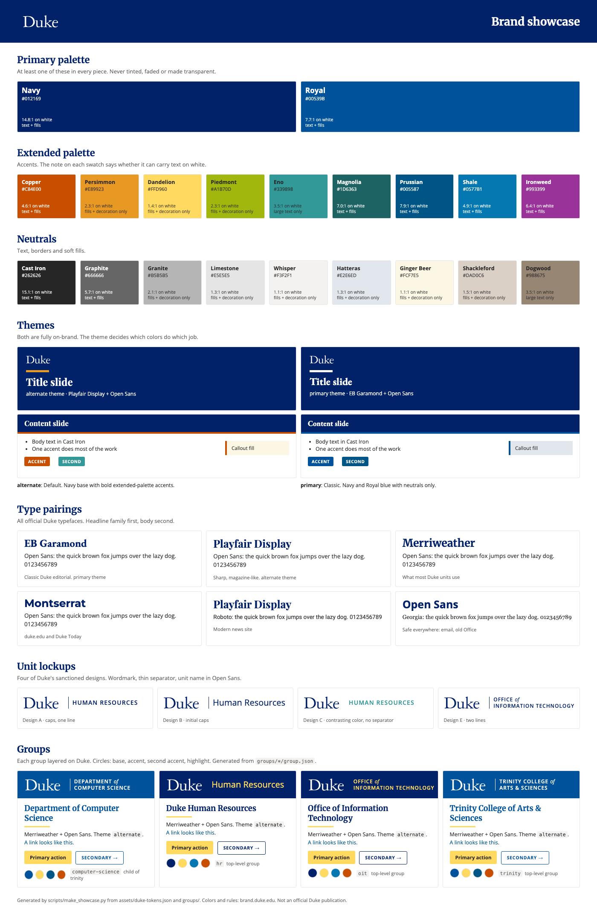
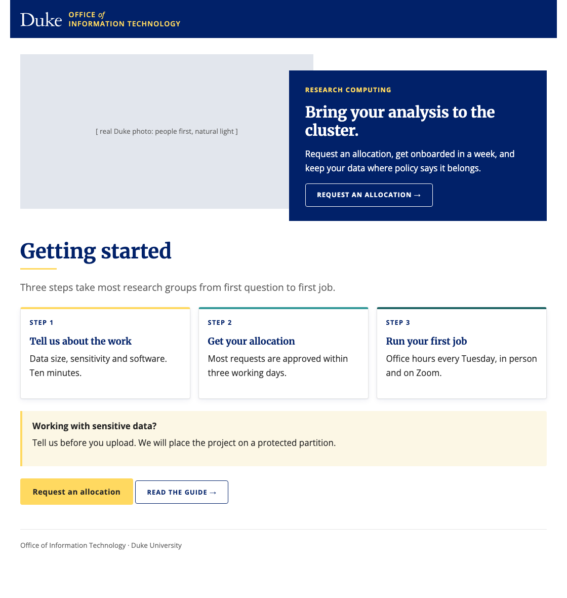
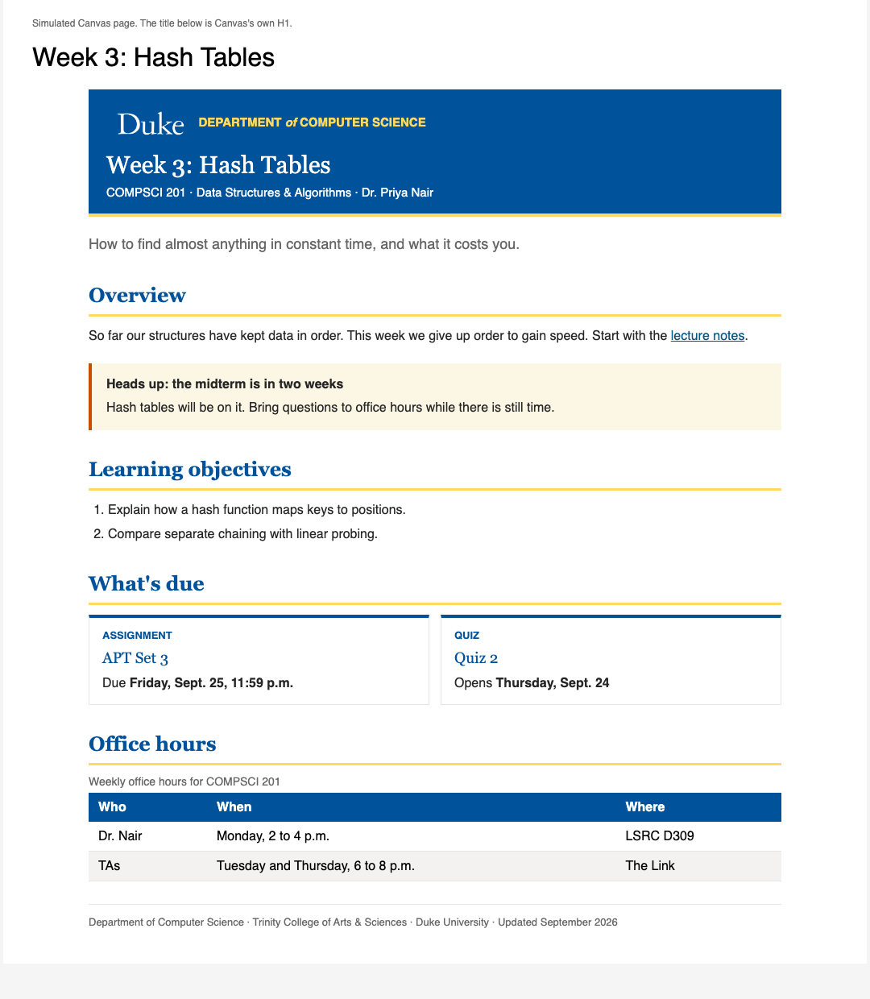
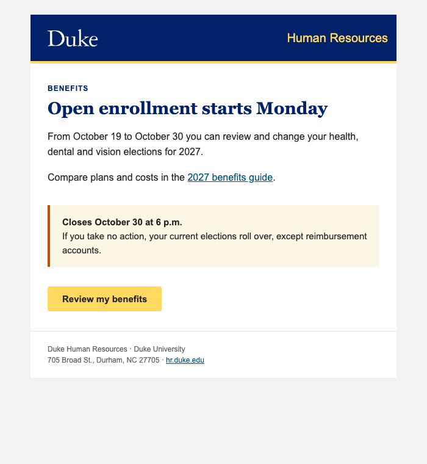

# duke-branding: an Agent Skill, and a worked example of how skills work

This repository is an [Agent Skill](https://agentskills.io): a folder in an open format that
any supporting AI agent can load (Claude, ChatGPT, Codex, Cursor, GitHub Copilot, Gemini CLI
and others). It applies Duke University's brand identity to anything the agent produces: slide
decks, Word documents, PDFs, web and Canvas pages, email, social graphics, video cards.
It can also layer a specific group's branding (Trinity, Computer Science, HR, ...)
on top of Duke's.

It is also meant to be read. The sections below use it to show how a skill is put
together and what happens when one runs.

## Install

This repository is three things at once, from one set of files:

- **a skill**: `SKILL.md` is at the root, so the folder can be dropped into any agent;
- **a plugin**: `.claude-plugin/plugin.json` declares the root as its one skill;
- **a marketplace**: `.claude-plugin/marketplace.json` lists that plugin. Claude Code reads
  this format natively, and OpenAI's workspace import accepts it as "a Claude-compatible
  marketplace", so one file serves both.

Pick the route that matches how you want updates to arrive.

### Route 1: marketplace (updates arrive by themselves)

**Claude Code.** Add the marketplace once, then install the plugin:

```
/plugin marketplace add git@gitlab.oit.duke.edu:ai-tech/skills/duke-branding.git
/plugin install duke-branding@duke-branding
```

Then open `/plugin` > Marketplaces > `duke-branding` and switch on auto-update.

**Claude Desktop.** Customize > Plugins > Add, from the GitHub URL above. The plugin page's
**Update** button pulls the latest commit on demand (tested). The skill then runs in a
sandbox whose home folder is not yours, so wordmarks come from a connected folder or an
attachment, see below. Use the SSH
address as shown: Claude Code's background update check cannot sign in to a private
repository over HTTPS, but SSH works when your key is loaded. The GitHub mirror works too:
`/plugin marketplace add wjshamblin/duke-branding`. Tested from both with the `claude` CLI.

**ChatGPT (Enterprise, Edu, Business workspaces).** A workspace admin does this once:

1. Workspace settings > Plugins > Add > Import marketplace.
2. Source: `https://github.com/wjshamblin/duke-branding`. Leave Path and Branch empty.
3. Authorize GitHub with an account that can read the repository (it is private).
4. Review the import results, then set the plugin's installation policy: Available, or
   Installed for the roles that should have it.

OpenAI then syncs the marketplace daily, and Sync now forces it. OpenAI's import reads
github.com only, which is why the GitHub mirror exists. **Not yet tested**: the file format
follows OpenAI's documentation, but nobody has run this import. If it rejects the root
layout, the fallback is Route 3.

### Route 2: clone into a skills folder (update with `git pull`)

| Agent | Install |
|---|---|
| Claude Code | `git clone git@gitlab.oit.duke.edu:ai-tech/skills/duke-branding.git ~/.claude/skills/duke-branding` |
| Codex CLI, ChatGPT desktop app | the same clone, into `~/.agents/skills/duke-branding` |
| One project only | the same clone, into `.claude/skills/` or `.agents/skills/` inside the project |

One clone can serve several agents: clone once, then symlink it into each agent's skills
folder (Codex documents that it follows symlinks). Keep the folder named `duke-branding`.

### Route 3: upload a zip (update by uploading again)

For ChatGPT on the web (Plugins > Skills > Create > Upload from your computer) and Claude on
the web or desktop (Customize > Skills > + > Create skill > Upload a skill):

```bash
cd .. && zip -r duke-branding.zip duke-branding -x "*/.git/*" "*/.claude-plugin/*" "*/NOTES.md" "*.DS_Store"
```

### Whichever route: the wordmark files are included

`assets/logos/tight/` is committed, so every route carries the official wordmark. A
project or machine can override it with its own copy in `./.duke-branding/logos` or
`~/.duke-branding/logos`. Install by one route only: a plugin and a folder copy of the
same skill both load, and the agent sees it twice.

Nothing in the skill assumes a particular agent. The frontmatter follows the
[specification](https://agentskills.io/specification) and passes its reference validator
(`uvx --from skills-ref agentskills validate "$PWD"`; the folder must be named
`duke-branding`, as the standard requires the folder and skill names to match). The scripts
are plain Python 3 with no dependencies, and `SKILL.md` says what to do by hand where an
agent cannot run them.

## Keeping it up to date

Which copy are you running? `SKILL.md` carries a `version` in its frontmatter metadata.
Compare it with the one in this repository.

How an update reaches you depends on how the skill was installed. Checked against each
vendor's documentation in September 2026; these products change quickly, so re-check.

| Installed as | How it updates | Automatic? |
|---|---|---|
| A git clone in a skills folder (Claude Code, Codex, ChatGPT desktop) | `git pull` in the folder. Codex picks up changes by itself, and Claude Code reloads a changed `SKILL.md` | One command. Put it in a scheduled job if you want it hands-off |
| A Claude Code plugin from a marketplace (Route 1) | The marketplace refreshes and the plugin follows. Any git host works, including GitLab | Yes, once auto-update is switched on for that marketplace (`/plugin` > Marketplaces) |
| A ChatGPT or Codex plugin from a workspace marketplace (Route 1) | An admin imports a marketplace repository once (Workspace settings > Plugins > Add > Import marketplace). OpenAI then syncs it | **Yes, daily**, plus a Sync now button. If an update is invalid the last working version stays. **github.com repositories only** |
| Uploaded to Claude (web, desktop) | Upload the new zip again | No, for your own upload |
| Shared in a Claude Team or Enterprise organization | The owner updates the skill once | Yes. Anthropic's help center says recipients "automatically get the updated version" |
| Uploaded to a ChatGPT workspace | The owner edits it in the Skills editor, asks ChatGPT to modify it, or uploads a new package | No sync from git. OpenAI's documentation describes workspace skills, local skill folders and plugins as separate paths that do not update each other |
| Shared or published in a ChatGPT workspace | The owner updates the workspace copy. Admins can see each skill's Updated date, download it, change its owner or delete it | OpenAI's help center does not say whether people who already installed it get the change, so check after updating |

Automatic updating is not a Claude-only feature. Both vendors do it the same way: not for
a bare skill, but for a **plugin listed in a marketplace**. A plugin is a small wrapper
(a `plugin.json` and a `skills/` folder) and a marketplace is a JSON catalog in a git
repository. Claude Code refreshes marketplaces when auto-update is on. ChatGPT syncs an
imported marketplace every day.

A skill uploaded on its own is different. In ChatGPT, and in Claude on the web, an
uploaded skill has no link to a git repository, so its owner has to edit or re-upload it.

For a team that wants hands-off updates:

1. Keep each skill in its own repository, like this one. That is the source of truth.
2. Add one marketplace repository that lists the skills as plugins.
3. Claude Code users add that marketplace once and switch on auto-update.
4. For ChatGPT, a workspace admin imports the marketplace. It must be on github.com: OpenAI
   states that other git hosts are not supported. A repository on GitLab therefore needs a
   mirror on GitHub, which GitLab can push to automatically.

This repository is packaged that way already: see Route 1 under [Install](#install).

**How a change reaches users.** The plugin declares no `version`, on purpose. Claude Code
then uses the git commit as the version, so every push to `main` is an update and there is
no release step to forget. (With a version set, users only update when someone remembers
to change it.) The `version` in `SKILL.md` is for people, so bump it when the change is
worth announcing.

**For maintainers.** GitLab is the source of truth and GitHub is a mirror. In the
maintainer's clone, `origin` has two push addresses, so one `git push` updates both:

```bash
git remote set-url --add --push origin git@gitlab.oit.duke.edu:ai-tech/skills/duke-branding.git
git remote set-url --add --push origin git@github.com:wjshamblin/duke-branding.git
```

With several contributors, replace that with GitLab's own push mirroring (Settings >
Repository > Mirroring repositories), so the mirror follows GitLab whoever pushes. After
changing the manifests, run `claude plugin validate .`.

Two things to remember when updating:

- **Wordmarks and your own groups survive.** Wordmarks in `~/.duke-branding/logos/` and profiles you keep in a project's `.duke-branding/groups/`
  folder are outside the skill, so an update never touches them. Profiles you added inside
  the skill's own `groups/` folder are ordinary files: `git pull` keeps them, a fresh
  upload replaces them.

Sources: [Skills in ChatGPT](https://help.openai.com/en/articles/20001066-skills-in-chatgpt),
[Build skills (OpenAI)](https://learn.chatgpt.com/docs/build-skills),
[Skill controls (OpenAI)](https://learn.chatgpt.com/docs/enterprise/skills),
[Use skills in Claude](https://support.claude.com/en/articles/12512180-using-skills-in-claude),
[Claude Code plugin marketplaces](https://code.claude.com/docs/en/discover-plugins),
[Importing and syncing plugin marketplaces from GitHub (OpenAI)](https://help.openai.com/en/articles/20001504-importing-and-syncing-plugin-marketplaces-from-github),
[Plugin management (OpenAI)](https://learn.chatgpt.com/docs/enterprise/plugin-management).

## What a skill is

A folder with a `SKILL.md` and whatever supporting files the task needs. There is no
code to register and no API. The agent reads the files.

```
duke-branding/       this repository
├── SKILL.md         Frontmatter (name, description, version) and the workflow
├── references/      Knowledge, read only when a step needs it
├── assets/          Files used in the output: CSS, templates, tokens, logos, examples
├── scripts/         Code that is run rather than read
├── groups/          This skill's own extension point: one folder per group
├── .claude-plugin/  plugin.json and marketplace.json, for marketplace installs
├── README.md        This file, for people
└── NOTES.md         What real use taught, and what changed
```

`SKILL.md` never mentions `README.md` or `NOTES.md`, so an agent never loads them. They
cost nothing at run time.

## Progressive disclosure: what gets loaded, and when

The key design idea. A skill can carry far more than fits comfortably in context,
because almost none of it is loaded until it is needed.



What this means in practice:

- **The description is the trigger.** It is the only part the agent sees before deciding
  to use the skill, so it lists the media, the group names and the phrases a user is
  likely to say. A vague description means a skill that never fires.
- **`SKILL.md` is a router, not an encyclopedia.** It says which reference to read
  for which deliverable. A request for a slide deck never loads the email guidance.
- **Scripts cost almost nothing.** `duke_brand.py` is about 250 lines, but the agent runs
  it and reads a few lines of output. It also makes the result deterministic: contrast
  ratios are computed, not estimated.

## What happens on a request

"Make a one-page flyer for the Computer Science open house":



## The skill's own workflow



## Group branding: layered profiles

A group is a `group.json` plus its logo files. `parent` makes a chain, and each layer
states only what differs from the one before it.



Profiles are looked up in `./.duke-branding/groups/` in the current project first, then
in the skill's own `groups/`. That lets a project carry its own group without touching
the installed skill.

```bash
python3 scripts/duke_brand.py groups
python3 scripts/duke_brand.py tokens --group computer-science --format css
python3 scripts/duke_brand.py contrast copper white     # 4.62:1  AA
python3 scripts/pptx_tools.py audit deck.pptx            # brand + accessibility audit
python3 scripts/pptx_tools.py theme deck.pptx --group oit
```

To add a group, copy `groups/_template/`, fill in what applies, and drop
the logo files beside it. Details: `references/group-branding.md`.

The four bundled profiles (`trinity`, `computer-science`, `hr`, `oit`) have real names and
URLs, but their accent colors are editable defaults, not official unit standards, and
they ship without logo files.

## Iterating: what the first real use taught

The skill was used on a real 25-slide deck the day it was written. It took the deck
from 28 audit problems to 0, and the skill itself turned out to have one wrong fact,
no review workflow, and several rules with no mechanism behind them. Each gap became
a change. [`NOTES.md`](NOTES.md) has the full record and the general lessons.



## See it



Finished examples, rebuilt from the skill's own templates by `scripts/make_examples.py`:

| Web page (OIT) | Canvas page (Computer Science) | Email (HR) |
|---|---|---|
|  |  |  |

## Measured, not assumed

Three realistic tasks, each run by a fresh agent with the skill and without it, graded by
script (the prompts and grader are kept with the maintainer's eval runs, outside this
repository). Round one: **97% with the skill, 82% without**, with a tie on the
Canvas page, where the logs showed the skill's guidance was wrong. After fixing it, round
two: **100% new skill, 93% old skill, 83% no skill.** The caveats matter as much as the
numbers, and both are in [`NOTES.md`](NOTES.md).

## Design choices worth copying

| Choice | Why |
|---|---|
| One reference file per medium | A deck request never pays for email guidance |
| Palette lives once, in `assets/duke-tokens.json` | The script, and through it every medium, reads the same values |
| CSS components read semantic variables (`--duke-accent`) | A theme or group is a 13-line override block, not a second stylesheet |
| The script fixes what it warns about | It emits a safe `on_accent` and `accent_text`, so a bad accent choice still yields accessible output |
| Sources cited in every reference | Brand rules change. A reader can check them |
| Working defaults are labelled as such | Where Duke publishes no rule, the file says so rather than inventing authority |
| Hard limits are stated as limits | Athletics marks, merchandise and partner co-branding route to Trademark Licensing |

## Official Duke assets

The ready-to-use wordmark files (`assets/logos/tight/`) are committed, so every install
carries them. Duke offers the files to its community behind a NetID login, but the same
artwork is served publicly by every duke.edu site, so nothing here is secret; the GitHub
mirror is public because Claude Desktop's plugin install requires it. What stays out of git:
the untouched originals and the sub-branding spec sheets, both downloadable from
https://brand.duke.edu/logos/#downloads and https://brand.duke.edu/branding/ with a NetID.
`assets/logos/README.md` covers sizing and which color to use on which background.

All colors, typography and rules come from https://brand.duke.edu/. This project is
not an official Duke University product.
