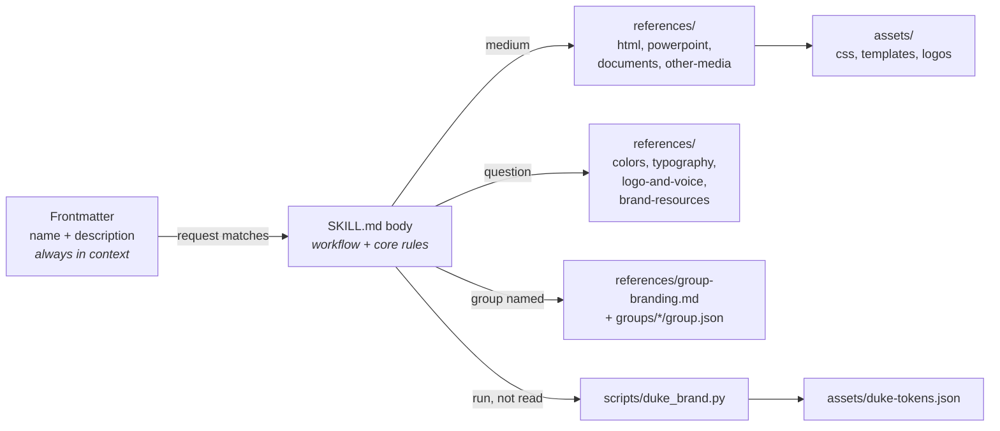
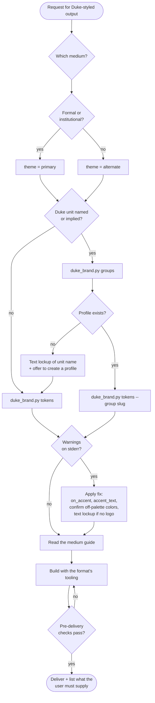
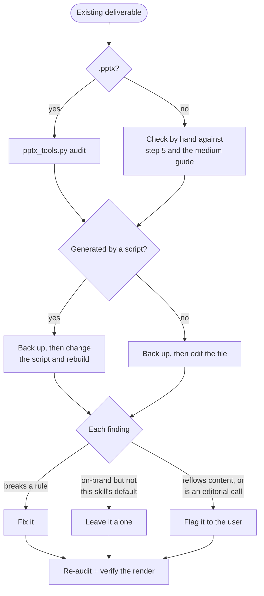
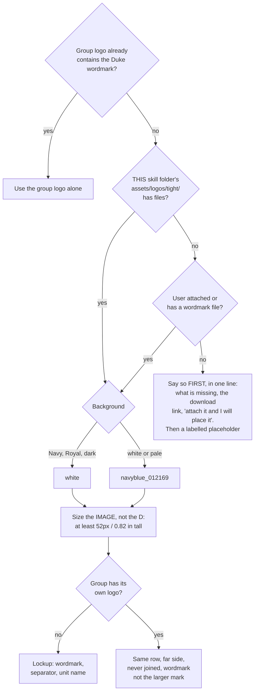

# Duke Branding

## Purpose

Make any deliverable recognisably and correctly Duke: right colors, right fonts,
wordmark rules respected, accessible, in Duke's voice. Optionally layer a group's
own identity on top. This skill supplies the brand specification and assets. Pair it
with whatever tooling builds the target format: another skill for pptx, docx or pdf, the
host agent's own slide or document features, or plain HTML.

## Bundled resources

```
duke-branding/
├── SKILL.md
├── scripts/
│   ├── duke_brand.py              Resolve theme + group into tokens; contrast checker; render inline-style templates
│   ├── pptx_tools.py              Audit a .pptx against the rules; write the Duke theme into one
│   ├── make_showcase.py           Rebuild assets/showcase/ (run after editing a group)
│   ├── make_examples.py           Rebuild assets/examples/ from the templates
│   └── make_tight_logos.py        Rebuild assets/logos/tight/ from original/ (setup only)
├── references/
│   ├── brand-resources.md         Every official URL: wordmark, fonts, palette, templates
│   ├── colors.md                  Primary + extended palette (HEX/RGB/CMYK/PMS), themes, AA ratings
│   ├── typography.md              Official typefaces, pairings, type scale, Office font pitfalls
│   ├── logo-and-voice.md          Wordmark rules, sub-brand lockups, co-branding, imagery, tone
│   ├── group-branding.md          Group profiles: fields, inheritance, workflow, logo placement
│   ├── real-world-patterns.md     How live Duke sites apply the brand: measured, with idioms to borrow
│   ├── html.md                    Canvas, web pages, dashboards, email
│   ├── powerpoint.md              Decks: setup, theme colors, slide layouts
│   ├── documents.md               Word and PDF: styles, document types, routes to PDF
│   └── other-media.md             Signatures, social, video, Zoom, signage, merchandise
├── assets/
│   ├── duke-tokens.json           Palette, themes, fonts (machine-readable)
│   ├── duke-alternate.css         Stylesheet with themable components
│   ├── canvas-page-template.html  Canvas starter: inline styles only, because Canvas strips <style>
│   ├── web-page-template.html     Standalone page starter: uses the stylesheet and classes
│   ├── showcase/                  showcase.png / .pdf: palette, themes, pairings, lockups, every group
│   ├── examples/                  Finished pieces to imitate (PNG) and their sources (src/)
│   ├── email-template.html        Table-based, inline-styled email starter
│   └── logos/                     Official wordmarks. README has the sizing table
│       ├── tight/                 Use these: canvas trimmed to the required clear space
│       ├── original/              Untouched official files
│       └── subbranding-reference/ Official lockup option and spec sheets (PDF)
└── groups/
    ├── _template/group.json       Copy to add a group
    ├── trinity/  computer-science/  hr/  oit/     Starter profiles
```

## How this skill loads

Only the frontmatter is always in context. The body loads when the skill triggers,
and each reference, asset or script is touched only when a step calls for it.



## Workflow



### 0. New work, or a review of existing work?

"Check", "review", "fix" or "enhance" an existing deliverable is a different job from
making one. The aim is to close gaps, not to restyle.



Steps 1 and 2 still apply (group and tokens), then read the medium guide's review
section. For decks that is "Reviewing an existing deck" in `references/powerpoint.md`.

### Look before building

- **Choosing a look with the user?** Show `assets/showcase/showcase.png` (or the PDF)
  rather than describing hex codes. People pick a theme, accent or group by eye.
- **About to build?** Open the matching picture in `assets/examples/` first. It shows
  what a finished, on-brand piece looks like, and its source is in `assets/examples/src/`.
- **Want it to feel like it belongs at Duke,** not merely pass the rules? Read
  `references/real-world-patterns.md`: the blue band header, the gold unit name, the
  heading rule and the other idioms real Duke units share.

### 1. Identify medium, theme and group

- **Medium** decides which guide to read (table below).
- **Theme:** default `alternate` (Navy base; Copper, Eno, Persimmon accents). Use
  `primary` (Navy and Royal with neutrals) for formal or institutional pieces or on
  request. `references/colors.md` explains the choice.
- **Group:** if the user names or implies a Duke unit, run
  `python3 scripts/duke_brand.py groups` and look for a match. With a match, apply
  it. Without one, proceed with Duke branding plus a text lockup of the unit name
  and offer to create a profile. Read `references/group-branding.md` whenever a
  group is involved.

### If scripts cannot run here

Some agents have no shell, no Python or a locked-down sandbox. Nothing in this skill
depends on the scripts: they only make the lookups faster and the checks exact.

- Colors, themes and font stacks: read `assets/duke-tokens.json`.
- A group: read `groups/<slug>/group.json`, then its `parent`, and let the child's values
  win. Use Royal as the base only where the profile says `"base": "royal"`.
- Contrast: use the rated tables in `references/colors.md`. Anything not listed there,
  treat as unverified and choose a listed pairing instead.
- Inline-style templates: replace each `{{name}}` with the matching color by hand.
- Deck audit: walk the checklist in "Reviewing an existing deck" in
  `references/powerpoint.md` by eye, and say that it was not machine-checked.

Paths in this skill are relative to the skill's own folder, wherever the agent installed it.

### 2. Resolve the tokens

```
python3 scripts/duke_brand.py tokens [--group <slug>] [--theme alternate|primary] [--format json|css]
```

Returns resolved hex colors, font stacks with Office fallbacks, the merged group
profile (logo paths, footer, contact, lineage) and warnings on stderr. Use these
values rather than retyping hex codes. Act on every warning.

### 3. Read the guide for the medium

| Deliverable                                              | Read                          |
|----------------------------------------------------------|-------------------------------|
| Canvas page, web page, dashboard, HTML email, newsletter | `references/html.md` (Canvas and email need inline styles: the host strips stylesheets) |
| PowerPoint, Keynote, Google Slides                       | `references/powerpoint.md`    |
| Word document, PDF, report, memo, letter, flyer, poster  | `references/documents.md`     |
| Email signature, social graphic, video, Zoom background, signage, merchandise | `references/other-media.md` |

Load as needed: `references/colors.md` for a specific color, print values or a
contrast question; `references/typography.md` when choosing fonts or producing
Office files; `references/logo-and-voice.md` for any wordmark, lockup, imagery or
copywriting question; `references/brand-resources.md` when the user needs an
official asset, template or link.

### 4. Place the wordmark



The official wordmark files belong in `assets/logos/tight/`, but a copy of this skill
may not have them: they are Duke trademarks behind NetID login, so they are not in git,
and a marketplace install or an early zip arrives without them. So, before building,
look **inside this skill's own folder**: the directory that contains this SKILL.md,
wherever the host put it (a sandbox mount such as `/mnt/skills/...`, `~/.claude/skills/`,
a plugin cache). List its `assets/logos/tight/`. That is the only place to look. Do not
search the user's home folder, Downloads, or any other folder named `duke-branding`:
those are not this skill, and asking for access to them wastes the user's time. If the
folder is empty, check whether the user attached a
`duke_wordmark*.svg` or `.png` or has one in the working folder, and use that. Only
then fall back to a placeholder, and make the first line of the reply say that the
wordmark is missing, why, where to get it
(https://brand.duke.edu/logos/#downloads, needs NetID), and that attaching the file is
enough for it to be placed. A placeholder mentioned only at the end of a long reply, or
not at all, gets published. Do not try to download the file: the site needs a login.

When a file is present, read
`assets/logos/README.md` for the file-to-background table and sizing: the capital D
is only 46% of the image height, so a wordmark sized by eye is usually below Duke's
minimum. Lockup geometry and the seven sanctioned designs are in
`references/logo-and-voice.md`. Never recreate the wordmark, and never draw, trace
or generate a Duke or group logo. Never recolor the files: pick the right color
variant instead.

### 5. Check before delivering

- A Duke blue is present, and neither blue is tinted, faded or made transparent.
- Every text/background pairing is AA. Check anything non-default with
  `python3 scripts/duke_brand.py contrast <fg> <bg> [<fg> <bg> ...]`. Use palette names
  (`cast-iron`, `ginger-beer`) or quote hex values: an unquoted `#` starts a shell comment.
- Fonts are official families, and Office files account for font availability.
- For a .pptx, `python3 scripts/pptx_tools.py audit` reports 0 problems.
- The output was rendered and looked at, not just generated.
- Wordmark clear space (half the D height) and minimum size are respected. With a
  group logo: same plane, not joined to it, wordmark never the larger of the two.
- Copy follows Duke's voice: confident, warm, plain, active, no hype.

### 6. Deliver

State the theme, group and accents used. List anything the user must supply or
replace (official wordmark, group logo, fonts to install). Offer one or two
alternate accent pairs.

## Core rules (always apply)

| Concern        | Rule                                                                       |
|----------------|----------------------------------------------------------------------------|
| Base color     | Duke Navy `#012169`, or Royal `#00539B` (Trinity and its departments use Royal). At least one in every piece |
| Blues          | Never alter opacity or saturation. No tints. Solid fills only              |
| Accents        | On a blue band, Dandelion `#FFD960` is what real Duke units use. `alternate`: Copper `#C84E00`, Eno `#339898`, Persimmon `#E89923`. `primary`: Royal, Prussian `#005587`, Shale `#0577B1` |
| Body text      | Cast Iron `#262626`; secondary Graphite `#666666`                          |
| Links          | Prussian Blue `#005587`, underlined                                        |
| Fonts          | `alternate`: Playfair Display + Open Sans. `primary`: EB Garamond + Open Sans. Any official pairing is fine. Microsoft 365 fetches the brand fonts itself (Office cloud fonts). Georgia + Arial for email, LibreOffice, Keynote and old Office |
| Wordmark       | Official file from `assets/logos/tight/`; clear space half the D; D at least 3/8 in or 24px, so image at least 0.82 in or 52px tall |
| Unit lockup    | Wordmark, separator, unit name in Open Sans Semi-Bold caps, wide-tracked; prepositions and articles lower-case Regular Italic; no separator when the name is in a contrasting color |
| Accessibility  | WCAG 2.0 AA minimum everywhere                                             |
| Out of scope   | Athletics marks, merchandise design, partner dual-branding: refer to Trademark Licensing. Duke Health and School of Medicine have their own brand centers (links in `references/brand-resources.md`) |
