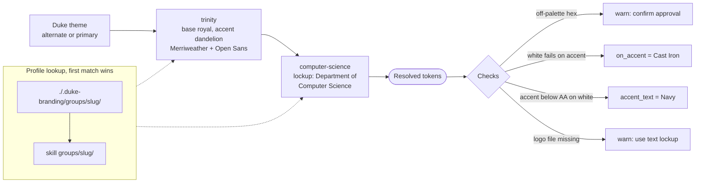

# Group Branding

Layer a school, department, office, lab, center or program's identity on top of Duke
branding. Duke stays the base. The group changes accents, fonts within the official
set, its lockup, its logo, and footer/contact details.

## What a group may and may not change

| May change                                          | Fixed                                                  |
|-----------------------------------------------------|--------------------------------------------------------|
| Accent, second accent, highlight                    | Navy or Royal present as the base in every piece       |
| Default theme (`alternate` or `primary`)            | The Duke wordmark, its clear space and minimum size    |
| Heading and body font, from the official families   | Wordmark on the same plane as, never joined to, and never larger than the group logo |
| Lockup text and orientation                         | Lockup typography: Open Sans Semi-Bold caps, prepositions lower-case Regular Italic |
| Own logo or symbol, footer, URL, contact block      | WCAG AA contrast                                       |

A group with a genuinely separate approved identity (Duke Health, School of
Medicine, some institutes) may use colors outside the Duke palette. The resolver
allows a hex value and warns. Keep it only if the user confirms the group is
approved to use it, and record the source in `brand_guide_url`.

## Where profiles live

Looked up in this order, first match wins:

1. `./.duke-branding/groups/<slug>/group.json` in the current project. Use for
   groups specific to one project or repo, and so profiles survive a skill update.
2. `groups/<slug>/group.json` inside this skill. Use for groups wanted everywhere.

Logo files sit in the same folder as `group.json`. Paths in the profile are
relative to that folder.

Bundled starter profiles: `trinity`, `computer-science` (child of trinity), `hr`, `oit`.
Their names, URLs, base blue, accents and fonts were **measured from each unit's live
site** (`references/real-world-patterns.md`), so they match what the unit already
looks like. They ship with no logo files. After editing a group, run
`python3 scripts/make_showcase.py` and look at its card.

## Profile fields

Template: `groups/_template/group.json`. Every field is optional except `name`.

| Field             | Meaning                                                                 |
|-------------------|-------------------------------------------------------------------------|
| `name`            | Full official name, used on first reference and in footers              |
| `short_name`      | For tight spaces: slide footers, badges, social avatars                 |
| `parent`          | Slug of the parent group. Unset or empty fields inherit from it         |
| `lockup.lines`    | Unit name split into display lines for a text lockup                    |
| `lockup.orientation` | `horizontal` or `stacked`                                            |
| `logo.primary`    | Logo for light backgrounds                                              |
| `logo.reversed`   | White/knockout logo for Navy and other dark fills                       |
| `logo.symbol`     | Icon-only mark for favicons, avatars, slide corners                     |
| `theme`           | `alternate` or `primary`                                                |
| `base`            | `navy` (default) or `royal`. Nothing else: every piece needs a Duke blue as its base |
| `lockup.style`, `lockup.color` | `initial-caps` for design B/D. A palette name sets the unit name in a contrasting color, and then no separator is drawn |
| `accent`, `accent_2`, `highlight` | Palette name (`copper`, `eno`, ...) or `#RRGGBB`        |
| `fonts.heading`, `fonts.body` | An official family name                                     |
| `url`, `footer`, `contact` | Printed in footers, closing slides, signatures                 |
| `brand_guide_url` | The group's own guidelines, if any. Read them before producing work     |
| `notes`           | Anything else: approved taglines, things to avoid                       |

### Inheritance ("knock-on" branding)



Each layer states only what differs; later layers win.

`parent` chains resolve root first: Duke theme, then each ancestor, then the group.
A child states only what differs. `computer-science` sets only its name, lockup, URL
and footer, and inherits the Royal base, Dandelion accent and fonts from `trinity`,
which is how the real sites relate. The resolver returns
`lineage` (for example `["trinity", "computer-science"]`). Use it to show the parent
on a second lockup line or in the footer.

Dict fields (`logo`, `fonts`, `lockup`, `contact`) merge key by key, so a child with
no logo of its own inherits the parent's. Say so when that happens, since a parent's
logo on a child's piece may not be what the user expects.

## Workflow

1. **Identify the group.** Run `python3 scripts/duke_brand.py groups`. Match what the
   user said against slug, `name` and `short_name`.
2. **No profile yet?** Offer to create one: copy `groups/_template/`, fill it in from
   what the user provides, and search for the unit's own brand guide (see
   `references/brand-resources.md`). Ask for logo files; never draw, trace or
   generate a logo. With no logo, use the text lockup.
3. **Resolve.** `python3 scripts/duke_brand.py tokens --group <slug>` prints JSON:
   resolved hex colors (including `on_accent` and `accent_text`), font stacks with
   Office fallbacks, the merged profile with absolute logo paths, and warnings.
   Add `--format css` for a paste-ready override block. Add `--theme` to override
   the group's default for one piece. A group's own accents always win over the
   theme's, so `--theme primary` on a Copper-accented group keeps Copper and
   changes the fonts, fills and remaining roles.
4. **Act on every warning.** They are printed to stderr:
   - *outside the Duke palette*: confirm approval with the user or pick a palette color.
   - *white text fails on accent*: use `on_accent` for text on accent fills.
   - *accent below AA on background*: use `accent_text` for small text and keep the
     accent to large headings, rules and shapes.
   - *logo not found* / *no logo files*: fall back to the text lockup and tell the user.
5. **Apply** using the medium guide. The group appears in four places: header
   lockup or logo, accent colors, footer line, and contact/closing block.

## Placing a group logo with the Duke wordmark

| Layout            | Placement                                                                  |
|-------------------|----------------------------------------------------------------------------|
| Web/Canvas header | Wordmark lockup left, group logo far right, same row                        |
| Email header      | Reversed wordmark left, reversed group logo or unit name right, Navy band   |
| Slide title       | Both on the bottom band: wordmark left, group logo right                    |
| Slide content     | Group symbol or short name in the footer; wordmark on title and closing slides only |
| Letter / memo     | Wordmark lockup top left; group logo top right or in the footer             |
| Flyer / poster    | Both along the bottom edge, same baseline, separated                        |

Match visual weight: size the group logo so it is at least as tall as the wordmark.
If the group logo already contains the Duke wordmark (an official sub-brand lockup),
use it **alone**. Do not add a second wordmark beside it.

## Adding or editing a group

```
groups/pratt/
├── group.json
├── pratt-logo.svg
└── pratt-logo-white.svg
```

After editing, run the resolver once to confirm it loads and to read the warnings.
